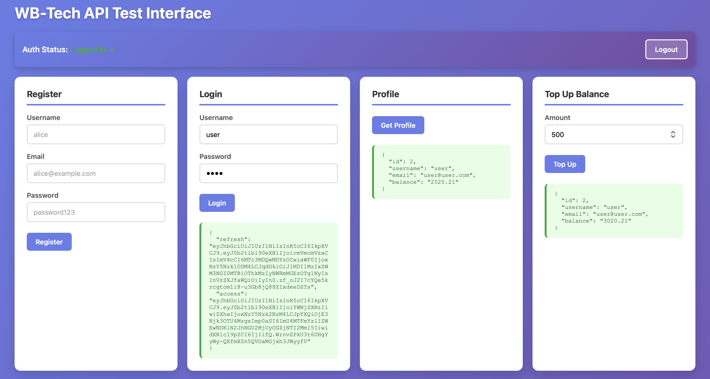
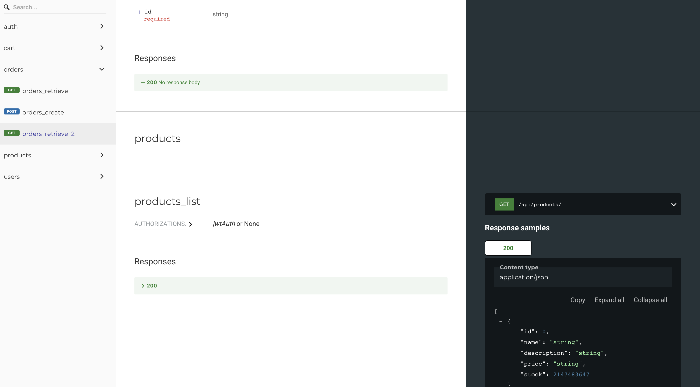
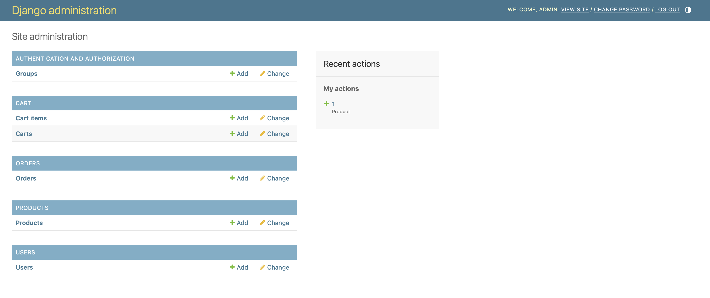

# WB-Tech Shop API

REST API интернет-магазина и базовый веб-интерфейс для тестового задания стажёра на Backend.

Проект реализован на **Django 4+** с **Django REST Framework**, **JWT авторизацией**, **PostgreSQL**, полной **автогенерируемой документацией** и разворачивается через **Docker Compose**.

---

## Возможности

- **Регистрация и авторизация** через JWT (access + refresh tokens)
- **Профиль пользователя** с балансом
- **Пополнение баланса**
- **Каталог товаров** (CRUD только для админов, просмотр для всех)
- **Корзина** (добавление, удаление, изменение количества)
- **Создание заказов** с проверкой остатков и баланса
- **Логирование успешных заказов** в консоль
- **Автогенерируемая документация** OpenAPI (Swagger + ReDoc)
- **Покрытие тестами** (17 test cases)
- **Docker + Docker Compose** для быстрого запуска

---

## Быстрый старт

### 1. Клонируйте репозиторий

```bash
git clone https://github.com/ifde/wbtech
cd wbtech
```

### 2. Запустите через Docker Compose

```bash
docker-compose up --build -d
```

### 3. Примените миграции и создайте суперпользователя

```bash
docker-compose exec web python manage.py makemigrations products cart orders
docker-compose exec web python manage.py migrate
docker-compose exec web python manage.py createsuperuser
```

### 4. Добавьте тестовые товары (опционально)

```bash
docker-compose exec web python manage.py populate_products
```

### 5. Откройте в браузере

- **Web-интерфейс для тестирования**: http://localhost:8000/
- **Swagger UI (интерактивная документация)**: http://localhost:8000/api/docs/
- **ReDoc (читаемая документация)**: http://localhost:8000/api/redoc/
- **Django Admin**: http://localhost:8000/admin/

Скриншоты:




Видео-демо:     

<video controls src="Screen Recording 2026-01-31 at 8.11.00 AM.mov" title="Title"></video>

---

## Документация API

### Форматы документации

| Формат | URL | Описание |
|--------|-----|----------|
| **OpenAPI Schema** | `/api/schema/` | JSON/YAML схема |
| **Swagger UI** | `/api/docs/` | Интерактивная документация с возможностью тестирования |
| **ReDoc** | `/api/redoc/` | Красивая читаемая документация с поиском |

### Основные эндпоинты

#### Авторизация

| Метод | Эндпоинт | Описание |
|-------|----------|----------|
| `POST` | `/api/users/register/` | Регистрация нового пользователя |
| `POST` | `/api/auth/token/` | Получить JWT токен (login) |
| `POST` | `/api/auth/token/refresh/` | Обновить access token |

#### Пользователи

| Метод | Эндпоинт | Описание | Авторизация |
|-------|----------|----------|-------------|
| `GET` | `/api/users/me/` | Получить профиль | Да |
| `POST` | `/api/users/balance/topup/` | Пополнить баланс | Да |

#### Товары

| Метод | Эндпоинт | Описание | Авторизация |
|-------|----------|----------|-------------|
| `GET` | `/api/products/` | Список товаров | Нет |
| `GET` | `/api/products/{id}/` | Детали товара | Нет |
| `POST` | `/api/products/` | Создать товар | Admin |
| `PUT` | `/api/products/{id}/` | Обновить товар | Admin |
| `DELETE` | `/api/products/{id}/` | Удалить товар | Admin |

#### Корзина

| Метод | Эндпоинт | Описание | Авторизация |
|-------|----------|----------|-------------|
| `GET` | `/api/cart/` | Просмотр корзины | Да |
| `POST` | `/api/cart/add/` | Добавить товар | Да |
| `POST` | `/api/cart/remove/` | Удалить товар | Да |
| `POST` | `/api/cart/update/` | Изменить количество | Да |

#### Заказы

| Метод | Эндпоинт | Описание | Авторизация |
|-------|----------|----------|-------------|
| `GET` | `/api/orders/` | Список заказов | Да |
| `GET` | `/api/orders/{id}/` | Детали заказа | Да |
| `POST` | `/api/orders/` | Создать заказ из корзины | Да |

---

## Логирование и уведомления о заказах

При успешном создании заказа система автоматически логирует информацию в консоль.

### Просмотр логов в реальном времени

```bash
docker-compose logs -f web
```

### Пример вывода при создании заказа

```
================================================================================
ORDER CREATED SUCCESSFULLY
Order ID: 1
User: alice (ID: 2)
Total Amount: $159.98
Items: Wireless Headphones x2
New User Balance: $340.02
================================================================================
```

### Просмотр только логов заказов

```bash
docker-compose logs web | grep "ORDER CREATED"
```

### Просмотр последних 100 строк логов

```bash
docker-compose logs --tail=100 web
```

---

## Тесты

Проект покрыт **17 тестами**, проверяющими все основные функции.

### Запуск всех тестов

```bash
docker-compose exec web python manage.py test
```


### Покрытие тестами

- Регистрация и авторизация пользователей
- Получение профиля и пополнение баланса
- Просмотр и создание товаров (с проверкой прав)
- Операции с корзиной (добавить/удалить/изменить)
- Создание заказов с валидацией баланса и остатков
- Проверка списания баланса и уменьшения остатков
- Обработка ошибок (недостаточно баланса/товара)

---

## Структура проекта

```
wbtech/
├── apps/
│   ├── users/          # Пользователи, профиль, баланс
│   ├── products/       # Товары
│   ├── cart/           # Корзина
│   └── orders/         # Заказы
├── wbtech/             # Основные настройки Django
├── docker-compose.yml  # Конфигурация Docker
├── Dockerfile          # Образ приложения
├── requirements.txt    # Зависимости Python
├── .env                # Переменные окружения
└── README.md           # Документация
```

---

## Технологический стек

| Технология | Версия | Назначение |
|------------|--------|------------|
| Python | 3.11+ | Язык программирования |
| Django | 4.2+ | Web-фреймворк |
| Django REST Framework | 3.14+ | REST API |
| PostgreSQL | 15 | База данных |
| JWT | - | Авторизация |
| drf-spectacular | 0.27+ | OpenAPI документация |
| Docker | - | Контейнеризация |
| Docker Compose | - | Оркестрация контейнеров |

---

## Пример использования API

### 1. Регистрация

```bash
curl -X POST http://localhost:8000/api/users/register/ \
  -H "Content-Type: application/json" \
  -d '{"username": "alice", "email": "alice@example.com", "password": "securepass123"}'
```

### 2. Получение токена

```bash
curl -X POST http://localhost:8000/api/auth/token/ \
  -H "Content-Type: application/json" \
  -d '{"username": "alice", "password": "securepass123"}'
```

Ответ:
```json
{
  "access": "eyJ0eXAiOiJKV1QiLCJhbGc...",
  "refresh": "eyJ0eXAiOiJKV1QiLCJhbGc..."
}
```

### 3. Пополнение баланса

```bash
curl -X POST http://localhost:8000/api/users/balance/topup/ \
  -H "Authorization: Bearer <access_token>" \
  -H "Content-Type: application/json" \
  -d '{"amount": "500.00"}'
```

### 4. Добавление товара в корзину

```bash
curl -X POST http://localhost:8000/api/cart/add/ \
  -H "Authorization: Bearer <access_token>" \
  -H "Content-Type: application/json" \
  -d '{"product_id": 1, "quantity": 2}'
```

### 5. Создание заказа

```bash
curl -X POST http://localhost:8000/api/orders/ \
  -H "Authorization: Bearer <access_token>" \
  -H "Content-Type: application/json"
```

## Команды управления

### Остановить контейнеры

```bash
docker-compose down
```

### Перезапустить с пересборкой

```bash
docker-compose up --build -d
```

### Выполнить команду в контейнере

```bash
docker-compose exec web python manage.py <command>
```

### Просмотреть запущенные контейнеры

```bash
docker-compose ps
```
